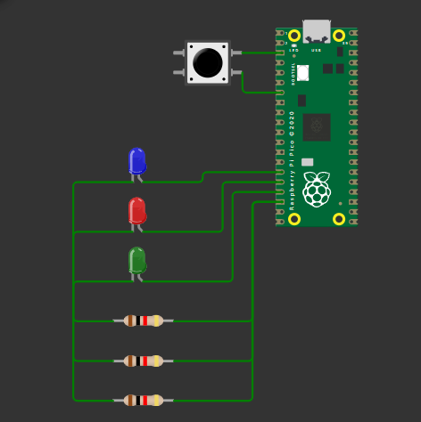

# Temporizador de um disparo (One Shot).

## Descrição
Com  o  emprego  da  função add_alarm_in_ms(),  presente  na 
ferramenta  Pico  SDK,  projete  um  sistema  de  temporização 
para o acionamento de LEDs, que atua a partir do clique em um 
botão  (pushbutton).

Neste projeto, você deverá utilizar os seguintes componentes conectados à placa BitDogLab: 
1. Microcontrolador Raspberry Pi Pico W. 
2. 03 LEDs (vermelho, amarelo e verde). 
3. 03 Resistores de 330 Ω. 
4. Botão (Pushbutton). 

Os requisitos para a realização desta atividade são: 
1. Caso o usuário clique no botão (pushbutton), os três LEDs serão 
ligados  (todos  em  nível  alto).  A  partir  da  primeira  rotina de atraso, ocorrerá uma mudança de estado para dois LEDs ligados e, em seguida, apenas um.

2. O temporizador do alarme deve ser ajustado para um atraso de 
3  segundos  (3.000ms),  entre  os  estados  de  acionamento  dos 
LEDs. 
 
3. A mudança de estado dos LEDs deve ser implementa em 
funções  de  call-back  do  temporizador,  a  exemplo  da  rotina 
trabalhada na aula síncrona - turn_off_callback(). 
 
4. O botão só pode alterar o estado dos LEDs quando o último LED 
for  desligado.  Deste  modo,  durante  a  execução  das rotinas  de 
temporização,  o  botão  não  pode  iniciar  uma  nova  chamada  da 
função call-back. 
 
5. Com  o  emprego  da  Ferramenta  Educacional  BitDogLab,  faça 
um experimento com o código deste exercício utilizando o LED 
RGB – GPIOs 11, 12 e 13 e o Botão A, GPIO 05. 
 
6. Opcional: Implementar uma rotina em software para atenuação 
do efeito bouncing no botão (software debounce).

## Circuito

## Como compilar
Para compilar o programa, utilize um compilador C, gerando os arquivos `.uf2` e `.elf`. Siga os passos abaixo:

1. Configure o ambiente de desenvolvimento para o Raspberry Pi Pico.
2. Compile o código utilizando um compilador compatível.

## Como executar
Após a compilação, execute o simulador Wokwi clicando no arquivo `diagram.json`:

Para testar, clique em "Play" no Wokwi e explore o circuito.

Para colocar na placa, clique em "compile" e em "run" com a placa conectada.

## Requisitos
- Compilador C (gcc ou equivalente).
- Sistema operacional compatível com programas C.
- Extensão Raspberry Pi Pico.
- Wokwi configurado no VS Code.
- Placa Raspberry Pi Pico - BitDogLab

## Desenvolvedora
- [Evelyn Suzarte](https://github.com/Evelynsuzarte)
